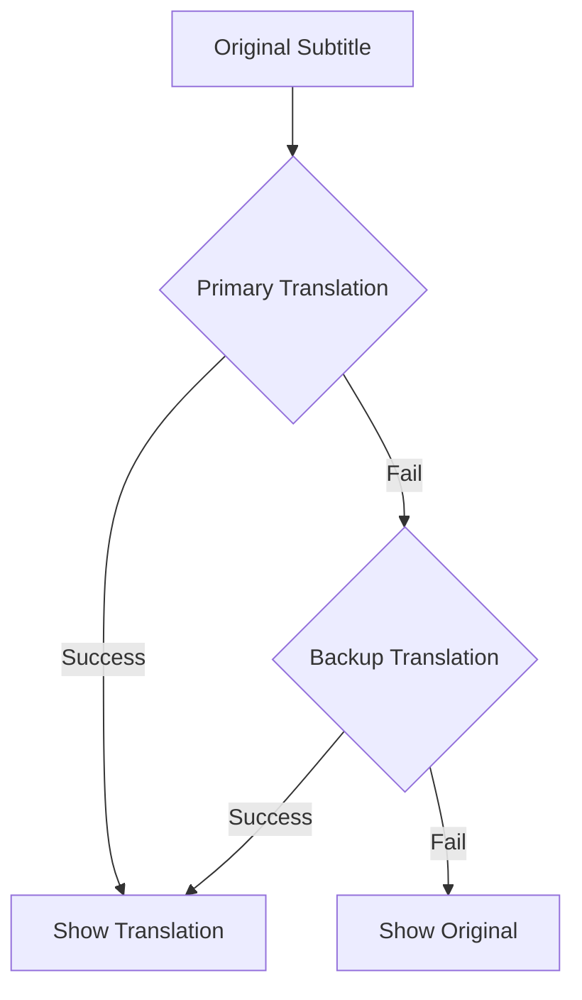

# 🌏 Bilibili Multi-Subtitle Translator

```ascii
 ____  _ _ _ _     _ _ _    ____        _     _   _ _   _      
| __ )(_) (_) |__ (_) (_)  / ___| _   _| |__ | |_(_) |_| | ___ 
|  _ \| | | | '_ \| | | |  \___ \| | | | '_ \| __| | __| |/ _ \
| |_) | | | | |_) | | | |   ___) | |_| | |_) | |_| | |_| |  __/
|____/|_|_|_|_.__/|_|_|_|  |____/ \__,_|_.__/ \__|_|\__|_|\___|
                                                                
     🔄 Real-time Translation | 🌍 Multi-language | 🎯 Zero-config
```

[](https://opensource.org/licenses/MIT)


> 🚀 A Chrome extension that adds real-time multi-language subtitles to Bilibili videos using Google Translate. Fire-and-forget translation that just works!

## ✨ Features

- 🔄 Real-time subtitle translation
- 🌍 Support for 100+ languages
- 🎯 Zero configuration needed
- 🎨 Customizable font sizes
- 🔥 UDP-style reliability (keeps going no matter what)
- 🎬 Beautiful subtitle styling
- ⚡ Instant fallback to original text if translation fails
- 🛠 No API keys required

## 🚀 Installation

1. Download or clone this repository
2. Open Chrome and go to `chrome://extensions/`
3. Enable "Developer mode" in the top right
4. Click "Load unpacked" and select the extension directory
5. Visit any Bilibili video and enjoy automatic translations!

## 🎮 Usage

1. Click the extension icon in Chrome
2. Select your target language
3. Toggle auto-translation on/off
4. Adjust font size if needed
5. That's it! Translations will appear below the original subtitles

## 🌍 Supported Languages

<details>
<summary>Click to expand language list</summary>

- Afrikaans
- Albanian
- Amharic
- Arabic
- Armenian
- Azerbaijani
- Basque
- Belarusian
- Bengali
- Bosnian
- Bulgarian
- Catalan
- Cebuano
- Chinese (Simplified)
- Chinese (Traditional)
- Corsican
- Croatian
- Czech
- Danish
- Dutch
- English
- Esperanto
- Estonian
- Finnish
- French
- Frisian
- Galician
- Georgian
- German
- Greek
- Gujarati
- Haitian Creole
- Hausa
- Hawaiian
- Hebrew
- Hindi
- Hmong
- Hungarian
- Icelandic
- Igbo
- Indonesian
- Irish
- Italian
- Japanese
- Javanese
- Kannada
- Kazakh
- Khmer
- Korean
- Kurdish
- Kyrgyz
- Lao
- Latin
- Latvian
- Lithuanian
- Luxembourgish
- Macedonian
- Malagasy
- Malay
- Malayalam
- Maltese
- Maori
- Marathi
- Mongolian
- Myanmar (Burmese)
- Nepali
- Norwegian
- Nyanja (Chichewa)
- Odia (Oriya)
- Pashto
- Persian
- Polish
- Portuguese
- Punjabi
- Romanian
- Russian
- Samoan
- Scots Gaelic
- Serbian
- Sesotho
- Shona
- Sindhi
- Sinhala
- Slovak
- Slovenian
- Somali
- Spanish
- Sundanese
- Swahili
- Swedish
- Tagalog (Filipino)
- Tajik
- Tamil
- Telugu
- Thai
- Turkish
- Ukrainian
- Urdu
- Uzbek
- Vietnamese
- Welsh
- Xhosa
- Yiddish
- Yoruba
- Zulu

</details>

## 🛠 Technical Details

The extension uses a unique "UDP-style" translation approach:



- Primary translation service with instant fallback
- No blocking or waiting for retries
- Graceful degradation to original text
- Optimized for real-world network conditions

## 🤝 Contributing

Contributions are welcome! Feel free to:

1. Fork the repository
2. Create a feature branch
3. Submit a pull request

## 📝 License

MIT License - feel free to use this in your own projects!

## 🌟 Credits

Built with love for the Bilibili community! Special thanks to:
- Google Translate for the translation service
- Bilibili for the amazing video platform
- The open-source community

---

<div align="center">
Made with ❤️ by the community
<br>
🌟 Star us on GitHub if you find this useful!
</div> 